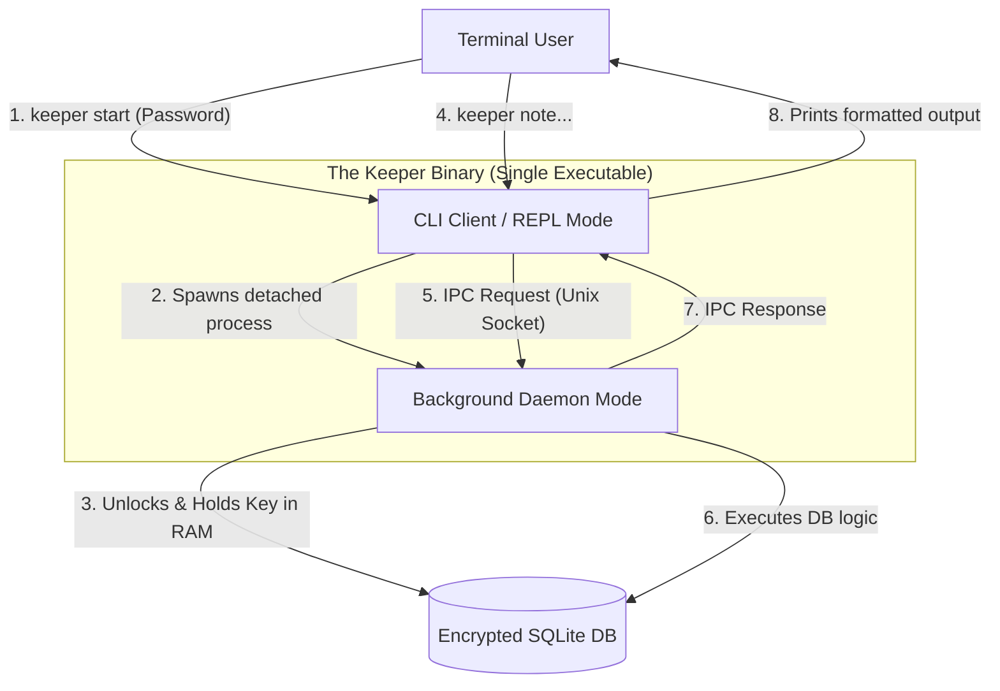

# 📕 Document 2: High-Level Design (hld.md)

### 1. Architecture Overview
Keeper uses a **Local Client-Server (Daemon)** architecture implemented within a single binary. This decouples UI from secure data management.

### 2. Component Breakdown

#### 2.1. The Client (Ephemeral Process)
Runs when user types a command. Short-lived.
* **Responsibilities:** Argument parsing (`clap`), REPL UI (`reedline`), IPC client connection, response formatting (`tabled`).
* **Security:** Never holds encryption keys.

#### 2.2. The Daemon (Long-running Process)
Runs in background after `keeper start`.
* **Responsibilities:** Holding decrypted key in memory, managing SQLite connection, listening on Unix Socket for requests, executing business logic.
* **Security Boundary:** This is the trusted component.

#### 2.3. Storage Layer
* **Technology:** SQLite 3 with SQLCipher.
* **Location:** `~/.keeper/vault.db`. All data encrypted at rest.

### 3. Security Considerations
* **Key Derivation:** Password hashed using Argon2.
* **IPC Security:** Unix Socket created with `0o600` permissions (user-only access).
* **Memory Hygiene:** Use crates like `zeroize` to wipe password/keys from memory when daemon stops.
